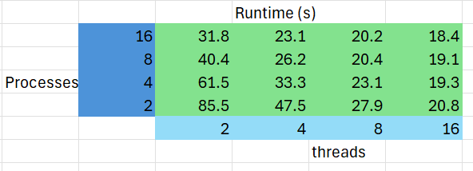

# System Programming Lab 11 Multiprocessing
---
#5
a. The implementation of my mandelmovie.c is meant to generate a series of Mandelbrot images that are set by using multiprocessing and then combining them into an animation. The program has the getopt function to parse command-line arguments that allows the user to specify parameters such as the number of processes, frames, image dimensions, and output directory. The generate_image function would calculate the pixel colors based on the iterations of the Mandelbrot set formula such as the scaling and positioning of the set dynamically for each frame. The runtime function incorporates the semaphores and process forking to manage the generation of frames by child processes. The workload is as close to even among them to enhance performance. Each child process would generate an even amount of frames, write them as JPG files, and then exits. The processes would need to be completed, so I used a wait(NULL) at the end. 

b. 
Child Processes	  Runtime (s)
1	               112.6
2	               115.6
5	               197.7
10	               220.8
20	               216.8

c. My results for my runtimes were from using the time ./mandelmovie -n (# of Child Processes). I used the user time to get as accurate results possible. As seen by the table and graph, I see that as the number of child processes increases, the runtime is larger since the the fork would split the frames up for each process. The rate would be by the frames/child process. An example would be if there are 10 processes and 50 frames, the runtime is larger since the amount of processes at each frame is 50/10 which is a total of 5 child processes with each one of them being at 10 frames. 

# System Programming Lab 12 Multithreading
---
a. The updated implementation of my mandelmovie.c is meant to do some threading by using pthread. The pthread functions I used was pthread_create for creating the threads and pthread_join for joining the treads. Throughout each process, the treads would divide the task of generating an image into smaller regions. The struct called Thread_Args would store the parameters that are specific to each thread such as the region of the image to modify. The compute function would create the iteration for each pixel in the thread's assigned region. The pixel data is then stored in an image buffer. The threading would create the treads by using the compute function to create. The implementation has the processing and threading happening with the frames. I made the maximum amount of threads be 20 and the minimum being 1. If it went out of that range, then the program would just end by using exit(1).

b. 

c. 
    i. The technique that seemed to impact the runtime more was the multitreading as seen by the table. I think that the multithreading impacted the runtime more because the treads seemed to work more efficiently by splitting the tasks into different workloads. Multiprocessing seemed to be less impactful since there would be a process going to multiple of the 50 frames desired which would make less of a decrease in runtime. 
    ii. There is a sweet spot where minimal runtime is achieved. The minimal runtime according to my table is at 16 threads and 16 processes since that is the lowest runtime. It seems that the sweet spot is when it is a maximal amount of threads. 
